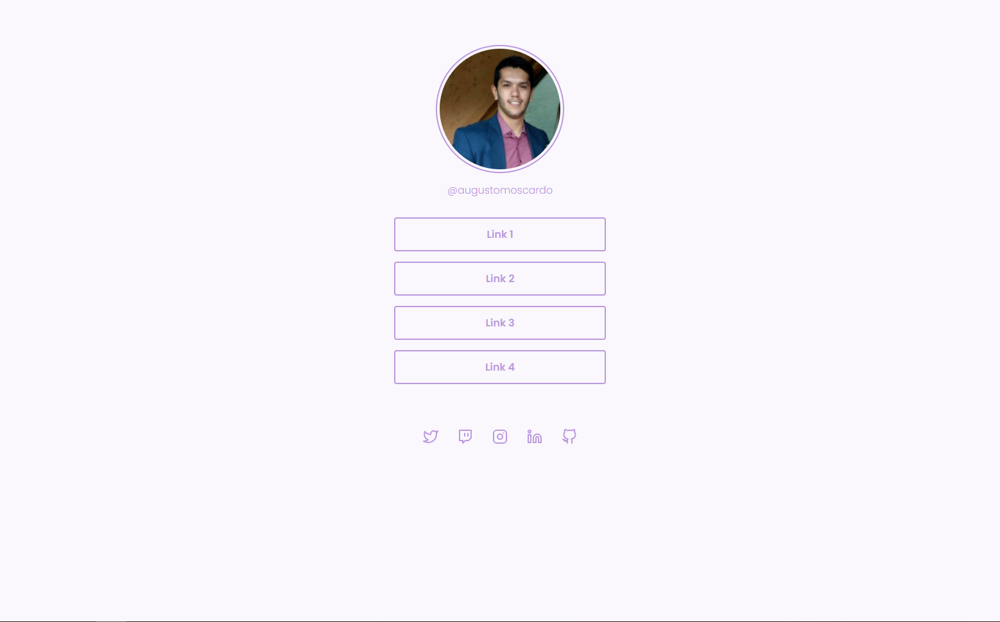

# Rockeseat - Socialtree Challenge
This is a solution to the [Socialtree](https://efficient-sloth-d85.notion.site/Desafio-Social-Tree-a4008e467a3248c4b05c97cf78aea44f) challenge on Rocketseat Discover.

## Getting Started

You can run Live Server, or copy index.html path and paste into the browser.

# Project view

  
  

## Technologies

- HMTL
- CSS

## 🔗 Links

## Badges

